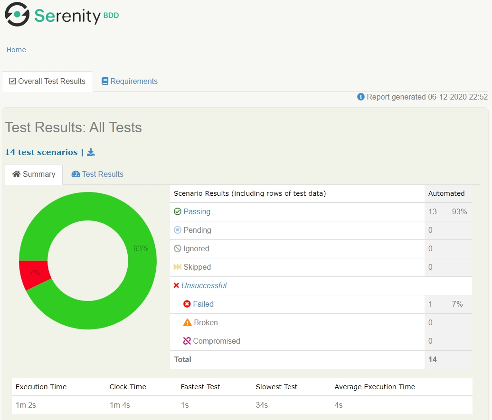
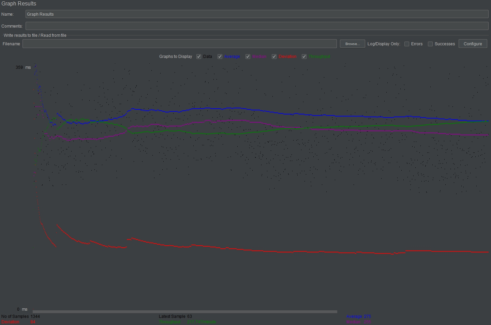
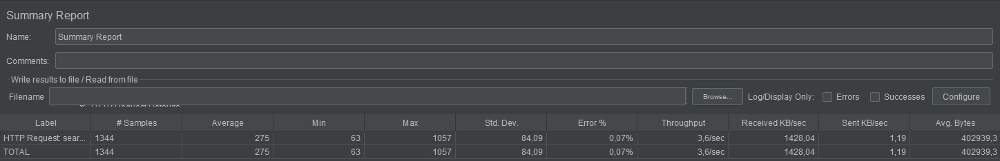

Selenium + Serenity

Start all tests

`mvn clean verify`

Start petstore API tests

`mvn clean verify -Dtags=PetstoreAPI`

Test report with screenshots generated in `target/site/serenity`

JMeter script for site https://www.wildberries.ru/ is in the `jmeter` folder

Graph Results

Summary Report  
